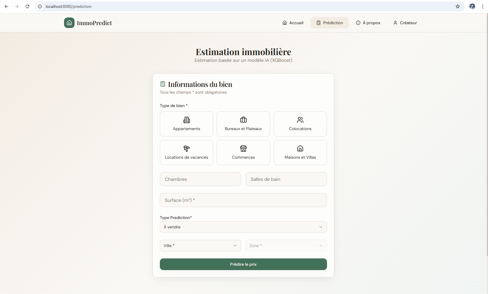
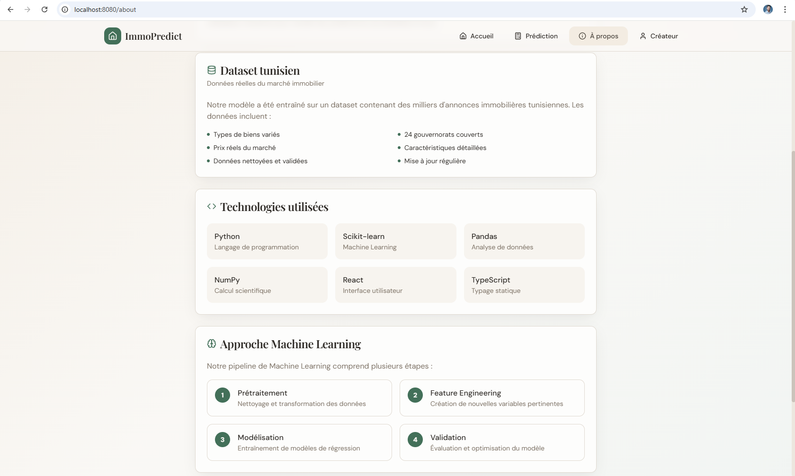
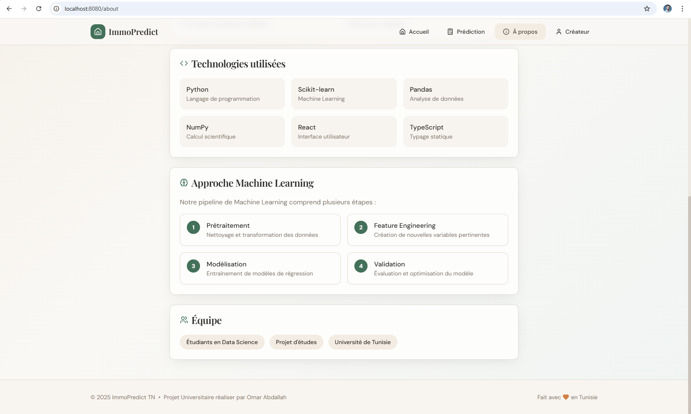
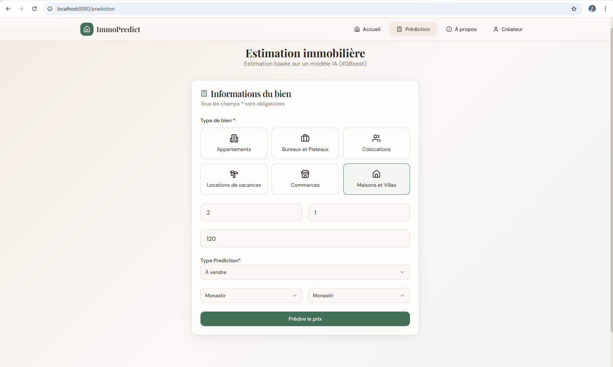
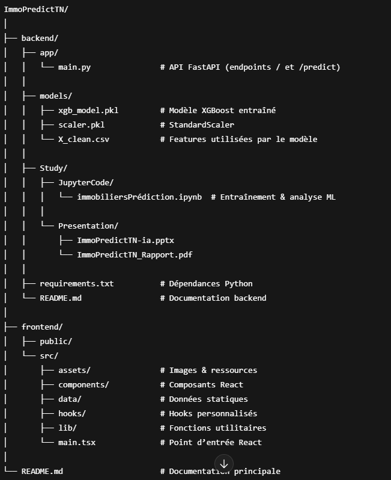

# ImmoPredictTN 🏠

**Estimation de prix immobilier en Tunisie via Intelligence Artificielle**

ImmoPredictTN est un projet **full-stack** combinant **React + TypeScript** pour le frontend et **FastAPI + Python** pour le backend.  
Le projet utilise un modèle **XGBoost** entraîné sur des données réelles du marché tunisien afin d’estimer le prix des biens immobiliers de manière rapide et précise.

## 💻 Captures d’écran

---

##📁 Structure du projet

## 🎯 Fonctionnalités principales

- Prédiction de prix pour : appartements, maisons, bureaux, commerces, colocations, locations vacances  
- Sélection du type de transaction : **À vendre / À louer**  
- Interface moderne et responsive  
- Sélection dynamique de la ville et de la zone  
- Affichage détaillé du bien : prix estimé et prix par m²  
- Backend RESTful avec endpoints `/` et `/predict`  

---

---

## ⚙️ Installation
🔧 Prérequis

Assure-toi d’avoir installé :

Python ≥ 3.10

Node.js ≥ 18

npm ≥ 9

Git

Vérification :

python --version
node --version
npm --version
git --version

🖥️ Installation Backend (FastAPI + Machine Learning)
# Cloner le projet
git clone https://github.com/USERNAME/ImmoPredictTN.git
cd ImmoPredictTN/backend

1️⃣ Créer un environnement virtuel

Windows

python -m venv venv
venv\Scripts\activate

macOS / Linux

python3 -m venv venv
source venv/bin/activate

2️⃣ Installer les dépendances
pip install --upgrade pip
pip install -r requirements.txt

3️⃣ Lancer l’API FastAPI
uvicorn app.main:app --reload

📍 API disponible sur :

http://localhost:8000

Documentation Swagger : http://localhost:8000/docs

✅ Test rapide :

GET http://localhost:8000/

🌐 Installation Frontend (React + Vite + TypeScript)
cd ../frontend
npm install

Lancer l’application
npm run dev

📍 Application disponible sur l’URL affichée par Vite
(exemple : http://localhost:5173
)

# DataSet

https://www.kaggle.com/datasets/ghassen1302/property-prices-in-tunisia

## 🧠 Modèle Machine Learning

Type : XGBoost Regressor

Pré-traitement :

Suppression des outliers (IQR)

Transformation logarithmique de price

Encodage : type, city, region, category

Normalisation StandardScaler

Fichiers sauvegardés :

xgb_model.pkl : modèle entraîné

scaler.pkl : scaler

X_clean.csv : colonnes features

🔗 Endpoints API
Méthode	Endpoint	Description
GET	/	Vérifie que l’API fonctionne
POST	/predict	Retourne le prix estimé

Exemple POST /predict :

{
  "room_count": 3,
  "bathroom_count": 2,
  "size": 120,
  "type_encoded": 1,
  "category_appartements": 1,
  "city_Tunis": 1,
  "region_Carthage": 1
}

Réponse :

{
  "estimated_price": 350000
}

## 🖥 Technologies utilisées

Frontend : React, Vite, TypeScript, TailwindCSS, Lucide-React

Backend : Python, FastAPI, Pandas, NumPy, Joblib, XGBoost, Scikit-learn

Visualisation : Matplotlib, Seaborn

Contrôle de version : Git & GitHub

